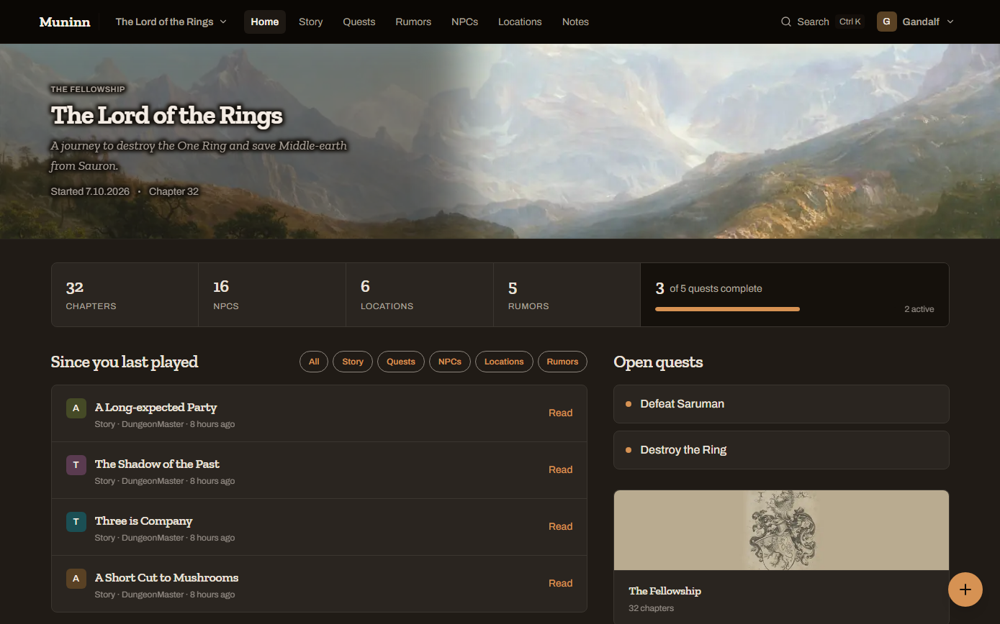
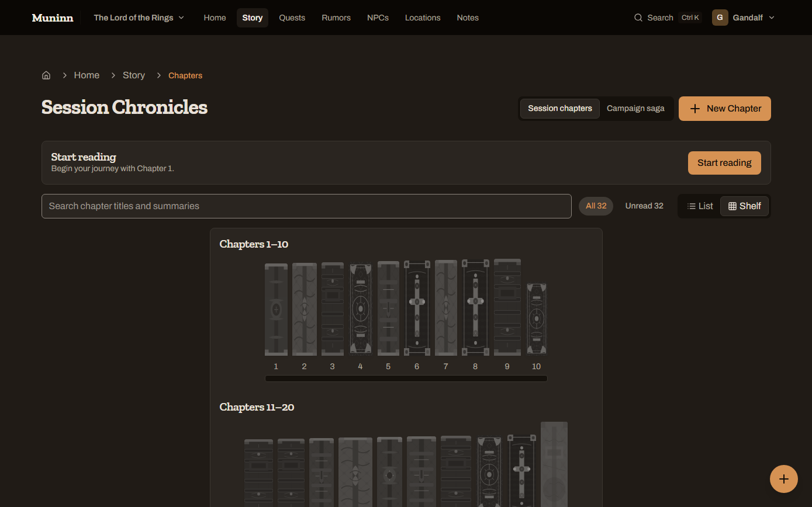
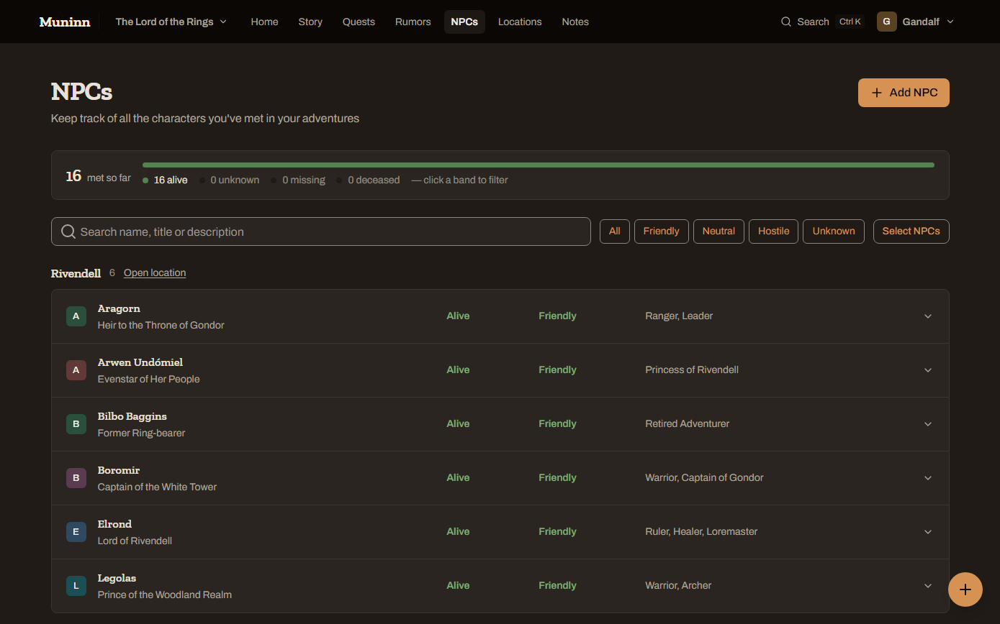
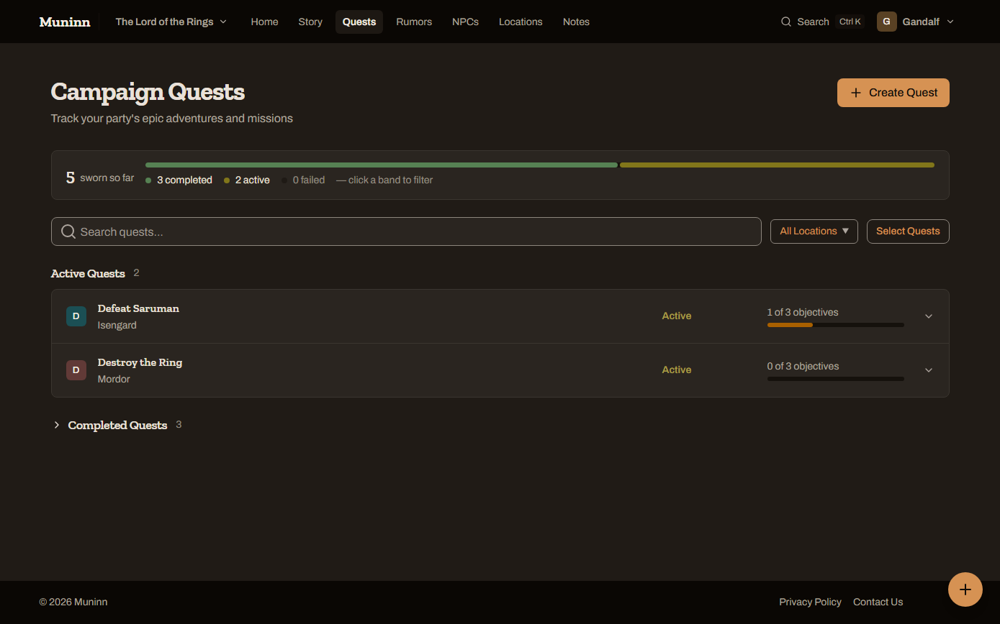

# Muninn

**Everything your table agreed happened, in one place.**

A shared campaign journal for tabletop roleplaying **players**: the story so far, the quests you've
sworn, the rumors you've heard, and every NPC and location you've met, written by whoever was at the
table and credited to the character who played it.

🔗 **[dnd-campaign-companion.web.app](https://dnd-campaign-companion.web.app/)** (private beta;
sign-in is by invitation only for now)

## What it does

- **Story.** A chapter log the whole group adds to, shown as a bookshelf or a list, or read as one
  continuous saga. Each player's reading progress is their own.
- **Quests.** Objectives with progress, linked to the places and people involved.
- **Rumors.** Mark them confirmed or false, merge duplicates, and turn the good ones into quests.
- **NPCs and locations.** Status, relationship to the party, and locations nested inside locations.
- **Private notes.** Your own session notes. AI picks out the NPCs, locations, quests and rumors in
  them so you can add them to the campaign in a click.
- **Search.** `Ctrl K` from anywhere, across the whole campaign.
- **Groups and campaigns.** A group can run several campaigns; admins invite players with a link.
  Sign-in is by magic link or Google, with no passwords.
- Light and dark themes, on desktop and phone.

| Chapters | NPCs | Quests |
|---|---|---|
|  |  |  |

## Built with

React 18 and TypeScript, Tailwind CSS, Firebase (Auth, Firestore, Storage, Functions, Hosting), and
OpenAI for note extraction, called only from Cloud Functions.

## Development

This is a personal project, and **outside contributions aren't being accepted during the beta**
([`CONTRIBUTING.md`](CONTRIBUTING.md) says what is welcome; security reports go privately, per
[`SECURITY.md`](SECURITY.md)). If you want to read or run the code anyway:

- [`CLAUDE.md`](CLAUDE.md) covers running it locally against the Firebase emulators, testing, and
  the architecture.
- [`docs/`](docs/README.md) holds the specs, the testing methodology and the bug tracker.

## License

[MIT](LICENSE) © Søren Haug ([@haugenau20](https://github.com/haugenau20))
